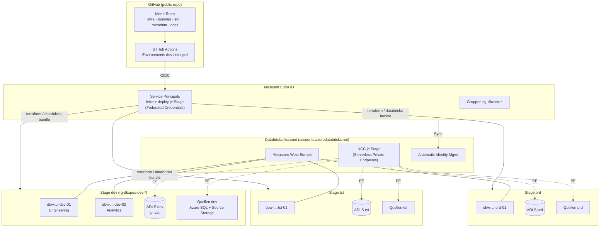
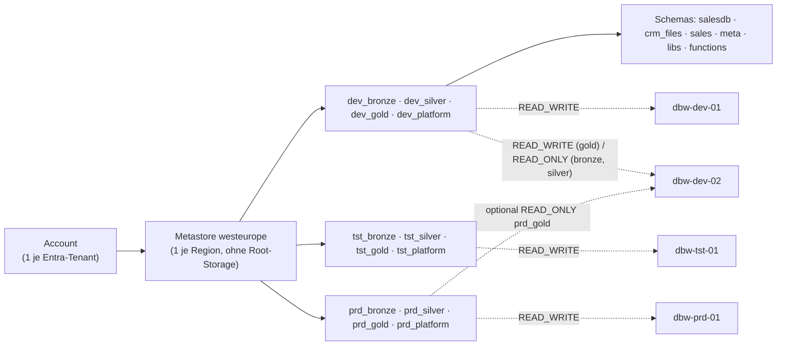
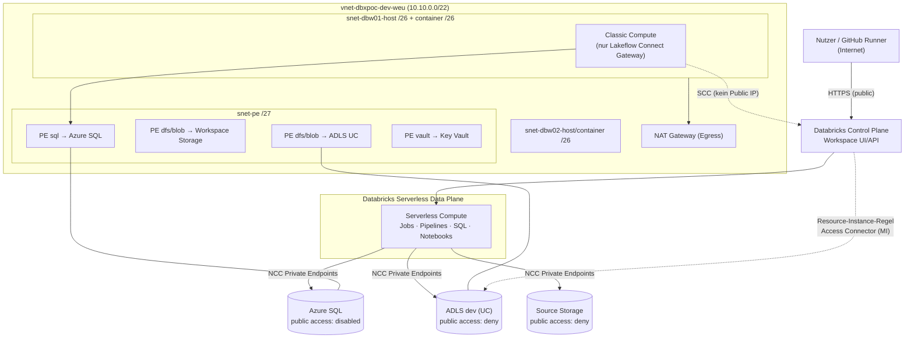
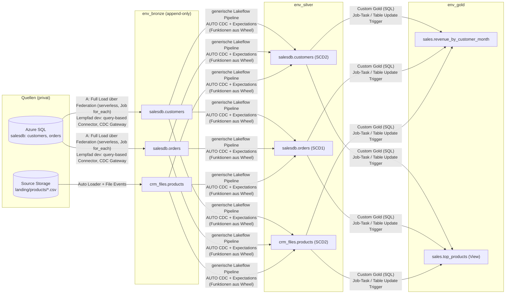
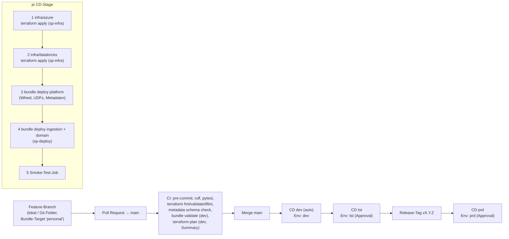
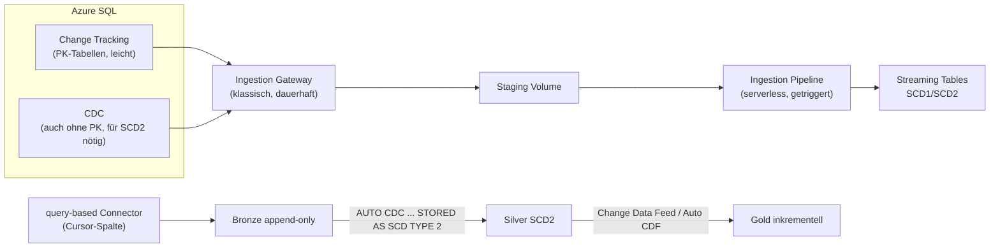

# Solution Design — Enterprise Databricks PoC auf Azure

> Phase 1 (Design). Es wurden **keine Ressourcen angelegt**. Alle Aussagen zu Databricks/Azure wurden
> am 2026-10-08 gegen die offizielle Doku geprüft.

**Legende:** **[F]** = Fakt mit Quelle · **[E]** = Empfehlung · **[A]** = Annahme (in Phase 2
verifizieren) · `Preview`/`Beta` = nicht GA.

**Bereits getroffene Entscheidungen (Rückfragen 2026-10-08):**

| # | Entscheidung |
| --- | --- |
| D1 | SQL-Ingestion: **beide Wege vergleichen**. Lakeflow Connect CDC mit Gateway (klassisch) **und** serverless Wege. |
| D2 | Workspaces: **dev ×2, tst ×1, prd ×1** |
| D3 | Kosten: **aufbauen und am selben Tag abreißen**, immer die günstigste Variante. IaC muss deshalb beliebig oft neu erzeugbar sein. |
| D4 | Repo **public**: `enricogoerlitz/databricks-architecture-poc-2026`. Damit gibt es GitHub Environments mit Required Reviewers. Keine Tenant- oder Subscription-IDs im Repo. |
| D5 | SQL-Standardpfad ist **Full Load im Batch** (kein CDC-Gateway). Query-based und CDC-Gateway kommen nur in den Lernpfad (dev). |
| D6 | Secrets setzt das Quell-Team (im PoC: Layer `sources`) **selbst in den Key Vault der Stage**. Databricks liest nur. |
| D7 | Ablauf: lokal aufbauen → dev E2E → tst → prd → Änderung in dev → erneut tst. Den Weg dokumentieren, dann die Workloads zurückbauen (Infra bleibt) → Lernpfad. |
| D8 | Stand nach dem Erstaufbau (2026-10-08): siehe Abschnitt „Abweichungen nach der Umsetzung“ direkt unter dieser Tabelle |

### Abweichungen nach der Umsetzung (2026-10-08)

Alle Details und Gotchas stehen in [`docs/runbooks/deployment-journal.md`](../runbooks/deployment-journal.md).

| Thema | Plan | Umsetzung | Grund |
| --- | --- | --- | --- |
| Databricks-Account | entsteht neu | **bestand bereits** (geteilt im Lab-Tenant, Metastore westeurope ohne Root-Storage) | Vorab-Check sah gelöschte Workspaces nicht |
| Metastore-Zuweisung | automatisch | **explizit per Terraform** | Auto-Zuweisung im Account nicht aktiv |
| Metastore-Owner | Gruppe `…-metastore-admins` | wie geplant, **bisherige Owner-Gruppe verschachtelt** | niemand verliert Zugriff |
| Entra-Gruppen über AIM | Sync aus Entra | **Databricks-Account-Gruppen** gleichen Namens | AIM im Account (aus 2024) nicht aktiv; account-weites Einschalten nur nach Abstimmung |
| Azure SQL | westeurope | **germanywestcentral** | `ProvisioningDisabled` für SQL in westeurope in dieser Subscription |
| Serverless → privat | NCC-Private-Endpoints | Regeln `ESTABLISHED`, greifen aber noch nicht → **Fallback** `storage_public_fallback` / `sql_public_access` (Entra-only bzw. nur Azure-Dienste) | Propagation laut Doku bis 24 h; Rückbau des Fallbacks = Lernpfad |
| SQL-Verbindung | Default | `connection_policy = Proxy` | Redirect leitet auf öffentlich aufgelöste Worker-Hosts um |
| Expectations bei `AUTO CDC FROM SNAPSHOT` | Decorators | `drop`-Regeln **zusätzlich als Filter** | Snapshot-Flow wertet Expectations der Quell-View nicht aus |
| Foreign-Catalog-Binding | im Setup-Job | **im Deploy-Schritt per CLI** | Job-Token darf `UpdateCatalog` nicht |
| CI-Identitäten | — | **keine Graph-Rechte**; Objekt-IDs als Secrets aus dem Bootstrap | Least Privilege |

---

## Inhalt

1. [Executive Summary](#1-executive-summary)
2. [Zielbild und Diagramme](#2-zielbild-und-diagramme)
3. [Antworten auf die Fragen 1–15](#3-antworten-auf-die-fragen)
4. [Umgebungen, Ressourcen, Namenskonvention, Tags](#4-umgebungen-ressourcen-namenskonvention-tags)
5. [Metadaten-Konzept mit Beispiel](#5-metadaten-konzept)
6. [Security- und Berechtigungskonzept](#6-security--und-berechtigungskonzept)
7. [Repo-Struktur](#7-repo-struktur)
8. [Kostenschätzung und Abschalten](#8-kostenschätzung-und-abschalten)
9. [Manuelle Schritte und Voraussetzungen](#9-manuelle-schritte-und-voraussetzungen)
10. [Umsetzungsplan Phase 2 und 3](#10-umsetzungsplan)
11. [Offene Entscheidungen](#11-offene-entscheidungen)
12. [Quellen](#12-quellen)

---

## 1. Executive Summary

Kurzfassung der Zielarchitektur:

- **Ein Databricks-Account** (je Entra-Tenant) und **ein Unity-Catalog-Metastore in West Europe**
  ([F][uc-metastore]).
- Die Umgebungen trennen wir über **Catalogs je Stage** (`dev_*`, `tst_*`, `prd_*`) und
  **Workspace-Catalog-Binding** ([F][uc-binding]). Einen Metastore je Stage gibt es nicht.
- Die beiden dev-Workspaces sehen dieselben dev-Catalogs. tst und prd sehen nur ihre eigenen.
- Jede Stage hat eigene Resource Groups, ein eigenes VNet, einen eigenen privaten ADLS-Gen2-Account,
  einen eigenen Key Vault und einen eigenen Access Connector.
- Der Code ist für alle Stages identisch. Was sich je Stage unterscheidet, steckt in Bundle-Targets
  und Terraform-`tfvars`.

**Kernempfehlungen:**

1. **Workspace public, Storage privat.**
   - Workspaces sind Premium und VNet-injected, mit Secure Cluster Connectivity und
     *Workspace Storage Firewall*.
   - Serverless erreicht den Storage über **NCC Private Endpoints** ([F][ncc-pl]).
   - Die Quellen (Azure SQL und Source Storage) sind ebenfalls nur privat erreichbar.
2. **Serverless für alle Workloads.** Einzige Ausnahme ist das Lakeflow-Connect-**Ingestion-Gateway**
   (CDC-Lernpfad, nur in dev). Es läuft zwingend auf klassischem Compute und dauerhaft
   ([F][lc-cdc], [F][lc-faq]).
3. **Ingestion ohne ADF:**
   - SQL im Standardpfad als **Full Load im Batch**: über **Lakehouse Federation** (serverless, NCC)
     mit `CREATE OR REPLACE TABLE … AS SELECT`. Das ist das Äquivalent zur Copy Data Activity.
   - Silver baut die Historie per **`AUTO CDC FROM SNAPSHOT`** (SCD2 aus Vollabzügen, [F][ldp-cdc]).
   - Dateien über **Auto Loader mit File Events** ([F][al-modes]).
   - Lernpfad (nur dev): **query-based Connector** (inkrementell, [F][lc-query]) und
     **CDC-Gateway**.
4. **Metadata-driven:**
   - **YAML im Repo ist die Source of Truth**, per JSON Schema validiert.
   - Beim Deploy entstehen daraus über **Python for Bundles** generierte Jobs und Pipelines
     ([F][dab-python]).
   - Zur Laufzeit werden die Metadaten zusätzlich als Delta-Tabelle veröffentlicht.
   - Watermarks braucht der Full Load nicht. Bei inkrementellen Pfaden verwaltet Databricks sie
     selbst (Checkpoints und Cursor). Eine eigene Watermark-Tabelle wie in Fabric entfällt.
   - Lakebase ist nicht nötig und dient nur als optionales Lernmodul.
5. **Wiederverwendbarer Code:**
   - Ein **Python-Wheel**, gebaut mit `uv` und deployt über Bundles in ein UC Volume je Stage.
   - Ausgewählte Funktionen zusätzlich als **UC Python UDFs**, die dasselbe Wheel per
     `ENVIRONMENT` referenzieren ([F][uc-udf]).
6. **Deployment:**
   - **Trunk-based mit Promotion** `dev → tst → prd` über GitHub Actions.
   - **GitHub Environments** mit Approval für tst und prd.
   - **OIDC/Workload Identity Federation**: keine Secrets in GitHub ([F][gh-oidc-dbx]).
   - Infrastruktur (Terraform) und Code (Bundles) laufen in getrennten Workflows und mit
     getrennten Identitäten.
7. **Bundles heißen jetzt „Declarative Automation Bundles“** (ehemals Databricks Asset Bundles).
   - CLI und `databricks.yml` bleiben gleich ([F][dab-rel]).
   - Ab CLI 1.20 gibt es nur noch die **Direct Engine**; die Terraform-Engine ist entfernt
     ([F][dab-direct]).

**Glossar (kurz):**

- **Ingestion Gateway:** Teil von Lakeflow Connect (CDC-Variante). Ein **dauerhaft laufender**
  Prozess auf klassischem Compute in deinem VNet.
  - Er liest das Change-Log der Quelle (Change Tracking/CDC) und schreibt die Änderungen in ein
    Staging Volume.
  - Eine serverless Ingestion Pipeline übernimmt sie von dort nach Bronze.
  - Analogie: Self-hosted Integration Runtime plus CDC-Reader in ADF.
- **NCC (Network Connectivity Configuration):** Objekt auf Account-Ebene, eins je Region, das man
  an Workspaces hängt.
  - Es legt fest, wie **Serverless Compute** (läuft in Databricks' Azure-Umgebung, nicht in deinem
    VNet) deine Ressourcen erreicht.
  - Dazu erzeugt Databricks Private Endpoints auf deinen Storage oder deine SQL. Du gibst sie auf
    der Zielressource frei ([F][ncc-pl]).
  - Analogie: Fabric Managed VNet und Managed Private Endpoints.
- **Foreign Catalog (Lakehouse Federation):** eine externe DB als Catalog in UC. Abfragen laufen
  live gegen die Quelle.

**Begriffs-Update 2026 (für Rückkehrer):**

| Früher | Heute (2026-10) |
| --- | --- |
| Databricks Asset Bundles (DABs) | **Declarative Automation Bundles** (Abkürzung DAB bleibt) |
| Delta Live Tables (DLT) | **Lakeflow pipelines** (auf Basis von OSS Spark Declarative Pipelines) ([F][ldp-name]) |
| `APPLY CHANGES INTO` | **`AUTO CDC`** (alte Syntax läuft noch) ([F][ldp-cdc]) |
| Workflows | **Lakeflow Jobs** |
| Delta Sharing | **OpenSharing** (seit 06/2026) ([F][opensharing]) |
| Lakehouse Monitoring | **Data Quality Monitoring** (Teil „Data Profiling“) ([F][dqm]) |
| Budget Policies | **Serverless Usage Policies** (`Preview`) ([F][usage-pol]) |
| Standard Tier | **abgeschafft**: neue Workspaces nur Premium ([F][std-tier]) |

---

## 2. Zielbild und Diagramme

### 2.1 Gesamtarchitektur



### 2.2 Unity-Catalog-Hierarchie und Workspace-Binding



### 2.3 Netzwerk (je Stage, Beispiel dev)



### 2.4 Datenfluss (Source → Bronze → Silver → Gold)



### 2.5 CI/CD-Flow



---

## 3. Antworten auf die Fragen

### Frage 1 — Sind Databricks-native Connectors ein vollwertiger ADF-Ersatz?

**Kurzantwort [E]:** Für **Datenbanken, SaaS und Dateien in Cloud-Storage: ja**. Für exotische
Quellen und hybride Szenarien mit Self-hosted IR wird es dünner. Dort helfen Lakehouse Federation,
die PySpark Custom Data Source API oder Partner-Tools.

| Mittel | Äquivalent in Fabric/ADF | Status | Netzwerk | Kosten |
| --- | --- | --- | --- | --- |
| **Lakeflow Connect query-based** (SQL Server u. a.) | Copy Activity mit Watermark | GA seit 2026-05-29 ([F][lc-query]) | **Serverless** über NCC-PE | Serverless-DBU, nur während eines Laufs |
| **Lakeflow Connect CDC** (Gateway + Pipeline) | CDC/Change Tracking-Copy | GA ([F][lc-ga]) | Gateway: **klassisch im VNet**, Pipeline: serverless | Gateway läuft **dauerhaft** (VM + DBU) |
| **Lakeflow Connect Integrated CDC** (ohne Gateway) | — | gated, Workspace-Flag über Account-Team ([F][lc-int]) | serverless möglich | nur während eines Laufs (mind. ca. 10 min Extraktion) |
| **Auto Loader** (`cloudFiles`) | Copy/Storage Event Trigger | GA ([F][al-modes]) | serverless über NCC-PE | Serverless-DBU |
| `COPY INTO` | Copy Activity (Batch) | GA ([F][copy-into]) | wie oben | wie oben |
| **Lakehouse Federation** | Shortcut/Linked Service-Query | GA ([F][fed-sql]) | serverless über NCC-PE | pro Abfrage, Last auf der Quelle |

**Grenzen von Lakeflow Connect SQL Server ([F][lc-limits]):**
- 250 Tabellen je Pipeline.
- Typänderungen und Umbenennungen von Spalten erzwingen einen Full Refresh.
- Kein Zeilenfilter.
- Zeitstempel landen in UTC.
- Gateway und Pipeline sind 1:1 gekoppelt.
- Der **Zeitplan des Gateways lässt sich nicht steuern** ([F][lc-faq]). Stoppt man es, droht ein
  Full Refresh, sobald die Log-Retention überschritten ist.

**Authentifizierung:** Die Doku nennt Basic Auth (SQL-User/Passwort). Die Limits-Seite erwähnt
zusätzlich Entra ID für Azure SQL. Die Seiten widersprechen sich ([F][lc-overview], [F][lc-limits]).

**Fazit zu ADF:**
- Gegenüber ADF fehlt kein Kernfeature für unseren PoC.
- Der Vorteil: Ingestion, Governance (UC), Lineage und Monitoring liegen an einem Ort.
- Der Nachteil: Ein dauerhaft laufendes CDC-Gateway kostet. Für Batch-Lasten mit Watermark ist der
  query-based Connector die günstigere Wahl.

**Plan für den PoC (D1, D5):**

- **A — Standard in allen Stages: Full Load im Batch.**
  - **Foreign Catalog** `<env>_src_salesdb` (Federation, serverless über NCC-PE).
  - Ein metadatengetriebener **Job mit `for_each`** ruft je Tabelle ein generisches Notebook auf:
    `CREATE OR REPLACE TABLE <env>_bronze.salesdb.<t> AS SELECT *, current_timestamp() AS
    _ingested_at FROM <env>_src_salesdb.dbo.<t>`.
  - Das ist 1:1 dein Fabric-Muster „ForEach + Copy Data“. Ein Gateway oder CDC in der Quelle ist
    nicht nötig.
  - Delta Time Travel hält vorherige Vollabzüge für die Retention-Dauer.
- **A2 — Lernpfad dev: query-based Connector** (inkrementell über eine Cursor-Spalte, serverless).
- **B — Lernpfad dev: CDC-Gateway** auf Basis von Change Tracking/CDC der Azure SQL.
  - Wir starten es nur für die Lern-Session.
  - Danach löschen wir die Pipeline.
- **C — Zero-Copy-Abfrage** auf den Foreign Catalog, ohne Kopie (siehe Frage 2).

**Bewertung im PoC:** Wir messen pro Pfad Einrichtungsaufwand, Latenz, Kosten (`system.billing.usage`,
`billing_origin_product = LAKEFLOW_CONNECT`) und Verhalten bei Schemaänderungen.

### Frage 2 — Shortcuts bzw. Zero-Copy-Bronze?

Ein 1:1-Gegenstück zu Fabric-Shortcuts gibt es nicht. Fabric-Shortcuts sind eine virtuelle Ordnerebene
über verschiedenen Quellen, auch mit Schreibzugriff. Es gibt aber mehrere Zero-Copy-Bausteine:

| Variante | Was | Status | Wann sinnvoll |
| --- | --- | --- | --- |
| **External Volume** über bestehende ADLS-Ordner | Dateien in-place lesen (Auto Loader, `read_files`) | GA | Landing-Zone, Dateien bleiben im Quell-Storage |
| **External Table** (Delta/Parquet in fremdem Storage) | Tabelle in UC, Daten bleiben im Storage | GA | Quelle liefert bereits Delta oder Parquet |
| **Lakehouse Federation** (Query) | Live-SQL auf DB, mit Pushdown | GA ([F][fed]) | Ad-hoc, kleine Dimensionen, Prototypen |
| **Catalog Federation** (z. B. **OneLake**, HMS) | Direktes Lesen der Tabellendateien | OneLake: GA 06/2026 ([F][onelake]) | **Fabric-Tabellen in Databricks** lesen, ohne Kopie |
| **OpenSharing** (Delta Sharing) | Tabellen zwischen Accounts/Orgs teilen | GA ([F][opensharing]) | Cross-Account/-Org; *foreign tables* werden beim Provider materialisiert |

**[E] Bronze bleibt bei uns eine Kopie (append-only).** Bronze ist die unveränderliche Historie und
entkoppelt uns von der Verfügbarkeit und Last der Quelle. Zero-Copy setzen wir gezielt ein:

1. **External Volume `landing`** über den Source Storage: Auto Loader liest dort in-place.
2. **Foreign Catalog `<env>_src_salesdb`** auf die Azure SQL. Das ist der Vergleichspfad C.
3. **OneLake-Federation** nur als Doku-Hinweis. Für deinen Fabric-Hintergrund ist es aber
   spannend: Fabric-Lakehouse-Tabellen lassen sich read-only in UC einhängen.

### Frage 3 — Wie sehen CDC-Pipelines aus SQL aus?



**Optionen:**

- **Lakeflow Connect CDC** ([F][lc-src-setup])
  - Change Tracking wird bevorzugt, sofern eine PK existiert.
  - CDC braucht man für Tabellen ohne PK und für **SCD2 direkt aus dem Connector**. Change Tracking
    unterstützt kein SCD2.
  - Vorbereitung: Ein Utility-Script legt die DDL-Capture-Objekte an. Dazu kommt ein eigener
    DB-User ([F][lc-utility]).
- **Query-based**
  - Inkrementell über eine Cursor-Spalte, mit SCD1, SCD2 oder append-only.
  - Soft Deletes laufen über `deletion_condition`. Das Tracking von Hard Deletes ist `Beta`
    ([F][lc-query]).
- **`AUTO CDC` in Lakeflow pipelines** ([F][ldp-cdc])
  - Ersetzt `APPLY CHANGES`.
  - Unterstützt SCD1/SCD2, `TRACK HISTORY ON` Spaltenteilmengen und `AUTO CDC FROM SNAPSHOT` für
    Voll-Snapshots.
  - Läuft auf serverless Pipelines.
- **Change Data Feed:** Silver liefert Gold die Änderungen. **Automatic CDF** (über Row Tracking) ist
  seit 2026-09 GA ([F][auto-cdf]).

**[E] Muster im PoC (Full Load, D5):**
- Bronze ist je Lauf ein **vollständiger Snapshot** (`CREATE OR REPLACE`).
- Eine **generische** Silver-Pipeline erzeugt daraus je Metadaten-Eintrag einen
  `AUTO CDC FROM SNAPSHOT`-Flow ([F][ldp-cdc]).
  - Die Pipeline vergleicht den neuen Snapshot mit dem vorherigen.
  - Daraus entstehen Inserts, Updates und **Deletes**, als SCD1 oder SCD2 je nach Metadaten.
  - CDC in der Quelle ist dafür nicht nötig.
- Das entspricht deinem Fabric-Muster „Copy nach Bronze, generisches SCD2-Notebook“, nur deklarativ
  und ohne eigene Watermark- oder Merge-Logik.
- **Grenze:** Ein Full Load skaliert schlecht bei sehr großen Tabellen. Dann wechselt man pro
  Tabelle per Metadaten (`load.type`) auf A2 (inkrementell) oder B (CDC).
- **[A]** Ob ein Lakeflow Pipeline direkt aus dem Foreign Catalog lesen kann, prüfen wir in
  Phase 2. Bronze als echte Delta-Tabelle zu halten, ist ohnehin besser: Die Quelle wird nur einmal
  belastet, und wir haben Time Travel.

### Frage 4 — Connections und Secrets pro Umgebung

**Fakten:**
- UC Connections und Foreign Catalogs sind **Metastore-Objekte**. Weil es nur einen Metastore gibt,
  sehen alle Stages denselben Namensraum.
- Workspace-Binding unterstützt Catalogs, External Locations, Storage- und Service-Credentials
  ([F][uc-binding]). Connections nennt die Doku dort nicht. Sie schützen wir per `USE CONNECTION`
  auf die Stage-Identitäten.

**[E] Prinzipien:**

1. **Secretless, wo möglich:**
   - Storage über den **Access Connector** (Managed Identity) → Storage Credential → External
     Locations.
   - Azure-Dienste über **UC Service Credentials** ([F][tf-credential]).
   - GitHub → Azure/Databricks über **OIDC**.
2. **Wo ein Secret unvermeidbar ist** (SQL-Login der Quelle), gilt D6:
   - **Ein Key Vault je Stage** (nicht je Workspace). Das **Quell-Team setzt das Secret selbst**
     dort, z. B. `salesdb-user` und `salesdb-password`. Databricks-Terraform kennt den Wert nie.
   - Im PoC simuliert der Terraform-Layer **`sources`** (eigener State, eigene RG) das fremde Team.
     Er legt SQL und Source Storage an und schreibt das Passwort in den Key Vault.
   - Jeder Workspace bekommt einen **Key-Vault-backed Secret Scope `kv`**, der auf den Key Vault
     seiner Stage zeigt. dev-01 und dev-02 teilen sich den dev-Key-Vault.
   - Die **UC Connection** braucht das Passwort beim Anlegen. Sie wird deshalb nicht von Terraform
     angelegt, sondern von einem Setup-Job per SQL ([F][fed-sql]):
     ```sql
     CREATE CONNECTION IF NOT EXISTS conn_dev_salesdb TYPE sqlserver
     OPTIONS (host '<sql-host>', port '1433',
              user secret('kv', 'salesdb-user'), password secret('kv', 'salesdb-password'));
     ```
     Das Secret landet **weder im Terraform-State noch im Repo**.
   - **Rotation:** Secret im Key Vault ändern, dann den Setup-Job erneut ausführen
     (`ALTER CONNECTION`).
3. **Gleicher Code, andere Werte:**
   - Der Scope heißt in jedem Workspace `kv`. `dbutils.secrets.get("kv", "salesdb-password")` ist
     damit in allen Stages identisch.
   - Catalog- und Connection-Namen kommen als Bundle-Variablen (`${var.env}`).
4. **Gotchas beim Key-Vault-backed Scope** ([F][dbx-secrets], [F][kb-aad]):
   - Der Key Vault muss das **Access-Policy-Modell** nutzen, nicht RBAC.
   - Anlegen geht nur mit einem **Entra-Token** (User oder Entra-SP über `github-oidc-azure`), nicht
     mit Databricks-OAuth-M2M.
   - Grants verwalten wir über `azurerm_key_vault_access_policy`, nicht inline.

**Alternative:** UC-native Secrets (Bundle-Resource `secret`, nur Direct Engine). Der Status ist zu
prüfen **[A]**. Wir beobachten das, setzen es im PoC aber nicht ein.

**Was je Stage variiert:**

| Wert | dev | tst | prd | Wo definiert |
| --- | --- | --- | --- | --- |
| SQL-Server-Host | `sql-dbxpoc-dev-<sfx>…` | `…tst…` | `…prd…` | Bundle-Target-Variable (kein Secret) |
| Catalog-Präfix | `dev` | `tst` | `prd` | Bundle-Target-Variable `env` |
| Key Vault | `kv-dbxpoc-dev-<sfx>` | … | … | Secret Scope `kv` (gleicher Name) |
| Connection | `conn_dev_salesdb` | `conn_tst_salesdb` | `conn_prd_salesdb` | `${var.env}` |
| Schedules | pausiert | pausiert | aktiv (PoC: pausiert) | `metadata/environments/<env>.yml` |

### Frage 5 — Deployment `dev → tst → prd`

**Werkzeuge im Vergleich:**

| Werkzeug | Wofür | Bewertung |
| --- | --- | --- |
| **Terraform** (`azurerm`, `databricks`) | Azure-Ressourcen, Account- und UC-Objekte (Catalogs, Locations, Grants, Bindings, Scopes) | **[E] für Plattform/Infra** |
| **Declarative Automation Bundles** (`databricks bundle`) | Jobs, Pipelines, Schemas, Volumes, Dashboards, Wheel-Artefakte | **[E] für Workloads/Code** ([F][cicd-flows]) |
| Git Folders | Entwickeln im Workspace | nur zum Authoring, nicht zum Deployen nach tst/prd ([F][cicd-flows]) |
| Bundles im Workspace | Deploy aus der UI | kein Cross-Workspace-Deploy, Doku empfiehlt CI/CD ([F][dab-ws]) |

**Branching-Varianten:**

| Variante | Pro | Contra |
| --- | --- | --- |
| **Trunk-based + Promotion** (main → dev auto → tst Approval → Tag → prd Approval) | ein Stand, kein Merge-Drift, dasselbe Artefakt wird befördert | braucht gute Checks und Gates |
| Release-Branches | stabilisierbare Releases, Hotfix-Pfad | mehr Branch-Pflege |
| Branch-per-Environment (dev/tst/prd-Branches) | intuitiv | **Anti-Pattern:** Drift, Merge-Konflikte, „was ist in prd?“ unklar |

**[E] Trunk-based mit Promotion**, wie von Databricks empfohlen ([F][cicd-flows]). Die Stufen:

- `main` deployt automatisch nach dev.
- tst folgt nach Approval.
- prd deployt nur von **Release-Tags `v*`**, nach Approval.
- Hotfixes laufen über einen kurzlebigen Branch → PR → Tag.

**Warum nicht feature → dev-Branch → tst-Branch → main (= prd)?**

1. **Rollback greift bei Trunk-based gerade nicht in main ein.**
   - prd-Rollback heißt: Deploy-Workflow mit dem vorherigen Tag erneut starten
     (`workflow_dispatch`, Input `ref=v1.2.2`). Das dauert Minuten und braucht keine Git-Änderung.
   - In dev und tst rollt man per `git revert` über einen PR zurück.
   - Bei Env-Branches braucht man ebenfalls Revert-Commits, und zwar je Branch. Danach muss man
     sie in die anderen Branches zurückmergen.
2. **Getestet = deployt.** Trunk-based bringt denselben Commit und dasselbe Wheel nach dev, tst und
   prd. Bei Env-Branches entsteht beim Merge ein neuer Commit. Sind die Branches auseinandergelaufen,
   z. B. durch Hotfixes, ist der prd-Stand nie getestet worden.
3. **Kein Drift.** „Was läuft in prd?“ ist einfach der letzte Tag.

**Ungetestetes kommt trotzdem nicht in main:** Auf dem Feature-Branch deployt man isoliert in den
dev-Workspace (`-t personal`, eigenes Präfix und Schema) und testet dort vor dem PR.

**Angelehnte Alternative** (falls Release-Stabilisierung gewünscht): main → dev,
`release/x.y` → tst, Tag auf dem Release-Branch → prd. Hotfixes macht man im Release-Branch und
cherry-pickt sie nach main.

**Gates und Identitäten:**
- **GitHub Environments** `dev`, `tst`, `prd` (public repo).
  - tst und prd haben **Required Reviewers**. Das bist du, „Prevent self-review“ ist aus.
  - prd erlaubt zusätzlich nur Deployments von Tags `v*`.
- **Je Stage zwei Entra-SPs:**
  - `sp-dbxpoc-<env>-infra` für Terraform.
  - `sp-dbxpoc-<env>-deploy` für Bundles und als `run_as` ([F][dab-runas]).
  - Beide haben Federated Credentials auf das GitHub-Environment der Stage. Es gibt **keine
    Client-Secrets**.
- **Gotcha OIDC-Subject:** Repos, die ab dem 2026-07-15 angelegt wurden, nutzen das neue Format mit
  unveränderlichen IDs, z. B. `repo:<owner>@<id>/<repo>@<id>:environment:prd` ([F][gh-oidc]). Unser
  Repo ist neu. Das Subject prüfen wir in Phase 2 am echten Token, bevor wir Federation Policies
  anlegen.
- **Bundle `mode: production`** für dev-ci, tst und prd ([F][dab-modes]). Das bedeutet:
  - `run_as` und `permissions` werden explizit gesetzt.
  - In prd gibt es eine `git.branch`-Prüfung.

**Trennung von Infra- und Code-Deployment:**
- Es gibt getrennte Workflows (`infra-*.yml` und `bundles-*.yml`) mit Pfadfiltern und getrennten SPs.
- Infra ändert sich selten und mit hohem Risiko: Es läuft Plan → Approval → Apply.
- Bundles ändern sich oft.

**Build once, deploy many:**
- Das Wheel wird **einmal** im CI gebaut und als Workflow-Artefakt bzw. Release-Asset abgelegt.
- tst und prd deployen **dieselbe Datei**. In dev ist `dynamic_version` erlaubt ([F][dab-libs]).

**Entwickler-Workflow in dev:**
- Lokal entwickeln (VS Code + Databricks Extension) oder im Workspace im **Git Folder**.
- Deployen mit `databricks bundle deploy -t personal`:
  - `mode: development` setzt das Präfix `[dev <user>]` und pausiert die Schedules.
  - Schreiben geht in die dev-Catalogs mit Schema-Suffix `_<user>`, damit es keine Kollisionen gibt.
- `deploy -t dev` macht **nur CI**.

**Notebooks: wo entwickeln, wo deployen?**

| Schritt | Ort |
| --- | --- |
| Entwickeln | (a) **dev-Workspace, Git Folder** = persönlicher Klon des Repos auf dem Feature-Branch, interaktiv auf serverless gegen die dev-Catalogs, Commit/Push aus der UI; oder (b) **lokal in VS Code** + Databricks Extension (Ausführung remote auf dev serverless) |
| Format im Repo | `.py` im Databricks-Source-Format (`# COMMAND ----------`) unter `bundles/<bundle>/src/`, also lesbare Diffs statt `.ipynb`-JSON |
| Persönlich testen | `databricks bundle deploy -t personal` → `/Workspace/Users/<du>/.bundle/<bundle>/personal/` |
| dev/tst/prd | Die CI deployt nach `/Workspace/Shared/.bundle/<bundle>/<env>/` (gehört dem Deploy-SP; Menschen: nur `CAN_READ`). Jobs zeigen auf diese Kopie. |
| Regel | In tst und prd wird **nie** im Workspace editiert. Jede Änderung geht über Git → PR → Pipeline. |

**GitHub Actions vs. Azure DevOps (Echtbetrieb):**

| Thema | GitHub Actions | Azure DevOps |
| --- | --- | --- |
| OIDC-Subject | je Environment, Branch, Tag oder PR fein steuerbar | je Service Connection (`sc://org/project/connection`) ([F][fed-policy]) |
| Approvals | Environments (private Repos: Enterprise nötig) | Environments + Approvals & Checks |
| Bundle-Support | dokumentiert ([F][gh-oidc-dbx]) | dokumentiert ([F][ado]) |

Die Konzepte sind gleich. Im Echtbetrieb wechselt nur die Pipeline-Syntax und das Federation-Subject.

### Frage 6 — Umgebungstrennung: Subscriptions (Zielbild) vs. Resource Groups (PoC)

**Zielbild [E]:**
- Je Stage eine eigene Subscription unter einer Management Group `mg-data-platform`.
- Dazu eine **Management/Connectivity-Subscription** für tfstate, zentrale Private DNS Zones und
  Hub-VNet.
- Policies und Budgets gelten je Subscription.

**PoC:**
- Eine Subscription, je Stage eigene RGs.
- **Damit der Wechsel später ohne Umbau geht:**
  - Jede Stage ist ein eigener Terraform-State mit eigener `envs/<env>.tfvars`, die `subscription_id`
    enthält.
  - Module kennen keine fremde Stage.
  - Private DNS Zones liegen im PoC je Stage in der Netz-RG. Im Zielbild wandern sie in den Hub.
  - RBAC wird nur auf RG-Scope vergeben. Im Zielbild wird daraus der Subscription-Scope.

### Frage 7 — Unity Catalog pro Stage?

**Fakten:**
- Es gibt **einen Metastore je Region und Account** ([F][uc-metastore]).
- Je Entra-Tenant gibt es genau einen Databricks-Account ([F][admin-concepts]).
- „Ein Unity Catalog pro Subscription“ gibt es also nicht. Der Metastore gilt account- und regionsweit.
- Dein Wunsch lässt sich trotzdem sauber umsetzen, aber anders:

**[E] Catalogs je Stage + Workspace-Catalog-Binding** ([F][uc-binding]):
- `dev_*`-Catalogs sind `ISOLATED` und an **beide** dev-Workspaces gebunden. Damit verwalten beide
  denselben „dev-Unity-Catalog“.
- `tst_*` ist nur an tst gebunden, `prd_*` nur an prd. Ein ungebundener Workspace wird abgelehnt,
  **selbst wenn Grants existieren**.
- Storage Credentials und External Locations sind ebenfalls an die Workspaces der eigenen Stage
  gebunden.
- **Getrennte Storage-Locations:**
  - Jede Stage hat ihren eigenen ADLS-Account.
  - Jeder Catalog hat einen eigenen Container als *Managed Location*.
  - Der Metastore selbst bekommt **keinen** Root-Storage. Das ist optional und wird empfohlen
    ([F][uc-metastore]).
- **Binding-Typen zeigen:**
  - dev-02 (Analytics) bindet `dev_bronze` und `dev_silver` **READ_ONLY**, `dev_gold` READ_WRITE.
  - Optional bekommt dev-02 `prd_gold` READ_ONLY. Das ist das typische Muster „Data Scientists lesen
    prd-Gold aus einem Nicht-prd-Workspace“.
- **Den automatisch erzeugten Workspace-Catalog** je Workspace nutzen wir nicht. Er ist an seinen
  Workspace gebunden und gehört den Workspace-Admins ([F][uc-binding]).

**Namenskonvention [E], Variante `<env>_<layer>`:**

| Catalog | Schemas | Zweck |
| --- | --- | --- |
| `<env>_bronze` | `<quelle>` (z. B. `salesdb`, `crm_files`), `landing` (External Volume) | Rohdaten, append-only |
| `<env>_silver` | `<quelle>` | bereinigt, SCD1/SCD2 |
| `<env>_gold` | `<domäne>` (z. B. `sales`) | Konsum |
| `<env>_platform` | `meta` (Metadaten-Tabellen), `libs` (Volume für Wheels), `functions` (UDFs), `ops` (Monitoring-Views) | Plattform |
| `<env>_src_salesdb` | (Foreign Catalog) | Federation-Vergleich |

**Alternative:** ein Catalog je Stage (`dev`, `tst`, `prd`) mit Schemas `bronze_salesdb`, …

| Kriterium | `<env>_<layer>` | `<env>` + Schemas |
| --- | --- | --- |
| Anzahl Catalogs und Bindings | höher | geringer |
| Rechte je Layer (z. B. Analysten nur Gold) | einfach auf Catalog-Ebene | auf Schema-Ebene |
| Storage je Layer | natürlich | über Schema-Managed-Location |

Die Variante `<env>_<layer>` ist verbreitet und skaliert besser. Siehe Entscheidung E1.

**Verifikation nach dem ersten Workspace:**
1. In der Account Console prüfen, ob es einen Metastore in westeurope gibt, wem er gehört und welche
   Workspaces zugewiesen sind.
2. Die Gruppe `sg-dbxpoc-metastore-admins` als Metastore-Admin setzen.
3. Prüfen, ob Automatic Identity Management aktiv ist. Für Accounts ab 2025-08-01 ist es Standard
   ([F][aim]).
4. Die Account-ID notieren. Sie kommt als GitHub-Variable und in die lokale tfvars.

Die manuellen Anteile stehen in Kapitel 9.

### Frage 8 — Python-Funktionen/Klassen zentral registrieren und wiederverwenden

| Option | Klassen? | Spark im Code? | Aufruf aus SQL | Wiederverwendung | Bewertung |
| --- | --- | --- | --- | --- | --- |
| **UC SQL UDF** | nein | nein | ja | alle gebundenen Workspaces | für einfache Ausdrücke, Masken, Row Filter |
| **UC Python UDF** (scalar/batch) | intern ja, Rückgabe skalar | **nein** (Sandbox, kein Spark/dbutils) | ja | alle gebundenen Workspaces; `ENVIRONMENT` mit Wheel/PyPI (GA) ([F][uc-udf], [F][uc-batch]) | Zeilenlogik für SQL-Nutzer, Agents |
| **Wheel in UC Volume** | **ja** | **ja** | nein (nur indirekt über UDF) | Jobs/Pipelines über `environment.dependencies` ([F][srv-deps]) | **[E] Hauptweg für Bibliothekscode** |
| Workspace-/Git-Folder-Module | ja | ja | nein | nur in diesem Workspace/Repo | für projektlokalen Code |
| Private Package Feed (Default Package Repositories) | ja | ja | nein | workspaceweit, GA ([F][pkg-repo]) | Echtbetrieb mit vielen Teams |
| Bundle `artifacts` + `libraries` | ja | ja | — | baut und verteilt das Wheel ([F][dab-libs]) | Vehikel für Variante 3 |

**[E] Im PoC:**
- **Paket `src/dbxpoc_common`** (pyproject + uv), z. B. mit `clean_string()`, `normalize_email()`,
  `parse_date_multi()` und einer kleinen Klasse `Scd2Config`.
- Das Bundle `platform` baut das Wheel und legt es nach
  `/Volumes/<env>_platform/libs/wheels/dbxpoc_common-<ver>-py3-none-any.whl`. Das Wheel muss
  **architekturneutral** sein, weil serverless auf x86 oder ARM läuft ([F][srv-deps]).
- Die Silver-Pipeline referenziert das Wheel in `environment.dependencies`, mit fester Version in
  tst/prd.
- Zusätzlich gibt es zwei UC Python UDFs `<env>_platform.functions.clean_string(s)` und
  `normalize_email(s)` mit `ENVIRONMENT (dependencies = '["/Volumes/.../dbxpoc_common-<ver>.whl"]',
  environment_version = '6')`. Damit ist **dieselbe Logik in Python-Pipelines und SQL** nutzbar.
- **Workspace-übergreifend:** Weil beide dev-Workspaces an `dev_platform` gebunden sind, sehen beide
  dasselbe Volume und dieselben UDFs. Zwischen den Stages gibt es nur Promotion, keine geteilte Kopie.
- **Versionierung:** SemVer aus dem Git-Tag. UDF-`COMMENT` und Docstring enthalten die Version.
  Einen Breaking Change bekommt eine neue UDF (`..._v2`), das Wheel eine neue Major-Version.

### Frage 9 — Metadata-driven Pipelines und Speicherort der Metadaten

Das Konzept steht in Kapitel 5. Hier der Vergleich der Speicherorte:

| Speicher | Versioniert & deploybar | Laufzeit-Lookup | UI-Pflege | Transaktional/viele kleine Updates | Governance (UC) | Aufwand |
| --- | --- | --- | --- | --- | --- | --- |
| **YAML/JSON im Repo** | **ja** (Git, PR-Review, Schema-Check) | nur über Deploy | nein (PR) | nein | indirekt | niedrig |
| **Delta-Tabelle in UC** | über Deploy-Job befüllt | **ja** (SQL, Lineage, Joins mit System Tables) | eingeschränkt | mäßig | **ja** | niedrig |
| **Lakebase (Postgres)** | Schema per Migration, Daten nicht git-nativ | ja (auch über Synced Tables) | **ja** (Databricks App) | **ja** | ja (Catalog) | mittel; IaC `Beta` ([F][lakebase-tf]) |
| Cosmos DB | nein | über Connector | eigene App | ja | **nein**, zusätzliches Netz/Secret | hoch |
| Nur Bundle-Variablen | ja | nein | nein | nein | — | zu begrenzt |

**[E] YAML im Repo als Source of Truth, dazu Delta als Laufzeit-Spiegel.**
- Ingestion-Pipelines und Jobs werden beim Deploy aus dem YAML **generiert** (Python for Bundles,
  GA, [F][dab-python]).
- Ein Task `publish_metadata` schreibt dieselben YAMLs nach `<env>_platform.meta.*` (Delta). Dort
  sind sie abfragbar, z. B. für Monitoring-Joins.
- **Run-State und Watermarks** verwalten Lakeflow Connect und Auto Loader bzw. die Pipelines selbst
  (Cursor, Checkpoints). Das ist der größte Unterschied zum Fabric-Muster mit Cosmos-Watermarks.

**Lakebase-Bewertung:**
- Sinnvoll, sobald Fachbereiche Metadaten **über eine UI** pflegen sollen, z. B. als Databricks App
  „Tabelle onboarden“, oder wenn eigene transaktionale Statusdaten anfallen.
- Lakebase ist GA in West Europe und skaliert auf null ([F][lakebase-rel], [F][lakebase-s2z]).
- Ein Trade-off bleibt: Metadaten in einer DB sind nicht mehr per PR reviewbar. Dann braucht es einen
  Export- oder Audit-Weg.
- **[E] Optionales Lernmodul in Phase 3:** Eine Lakebase-Instanz in dev mit Scale-to-Zero. Die
  Metadaten-Tabelle wird per *Synced Table* aus Delta nach Postgres gespiegelt. Dazu kommt eine Mini-App.

**Passung zu Databricks-Konzepten:**

| Fabric | Databricks |
| --- | --- |
| Pipeline mit ForEach über Tabellen | **generierte Pipeline-Definitionen** je Quelle (deklarativ), alternativ Job-Task **`for_each`** über eine Tabellenliste ([F][for-each]) |
| Copy Data Activity | Lakeflow Connect Ingestion Pipeline bzw. Auto-Loader-Flow |
| generisches SCD2-Notebook | **eine parametrisierte Lakeflow Pipeline**, die in einer Schleife je Metadaten-Eintrag einen `AUTO CDC`-Flow erzeugt |
| Trigger Gold | Job-Abhängigkeit (Task `run_job`) bzw. **Table Update Trigger** auf Silver-Tabellen ([F][table-trigger]) |

### Frage 10 — Workspace public, Data Plane Storage privat, inkl. Serverless

| Baustein | Umsetzung | Quelle |
| --- | --- | --- |
| Workspace UI/API | **public** (kein Front-End Private Link) | — |
| Klassische Compute-Knoten | **VNet Injection** + **Secure Cluster Connectivity** (kein Public IP), NAT Gateway als expliziter Egress | [F][vnet-inject], [F][scc] |
| Workspace-Storage (DBFS-Root im Managed RG) | **Workspace Storage Firewall**: eigener Access Connector, PE-Subnet, PEs `dfs`/`blob` | [F][ws-fw] |
| UC-Storage (eigener ADLS je Stage) | Public Network Access **„enabled from selected networks“ mit Default Deny**, *keine* IP-Regeln; Resource-Instance-Regel für den Access Connector, Trusted Services an; PEs aus dem VNet | [E], [A] Details in Phase 2 testen |
| Serverless → Storage/SQL | **NCC** je Stage mit **Private-Endpoint-Regeln** (`dfs`, `blob`, `sqlServer`); PEs auf der Zielressource freigeben | [F][ncc-pl], [F][ncc-rules] |
| Quellen (SQL, Source Storage) | Public Access aus, PE im Stage-VNet (für das Gateway) + NCC-PE (für serverless) | [F][ncc-rules] |
| Key Vault | Default Deny, Trusted Services an (für den KV-backed Scope), PE | [A] |

**Warum nicht „Public Network Access = Disabled“ beim UC-Storage?**
- **[A]** Die UC-Validierung (External Locations) und File Events greifen über die Managed Identity des
  Access Connectors zu. Dafür braucht es Resource-Instance- bzw. Trusted-Service-Regeln.
- Diese Regeln wirken nur bei „selected networks“, nicht bei „disabled“.
- Netzwerkseitig ist das trotzdem privat: Es gibt keine IP- oder VNet-Freigabe, nur PEs und die
  explizit genannte Ressource.
- In Phase 2 testen wir zuerst „Disabled“ und dokumentieren das Ergebnis.

**Alternative für serverless:** Network Security Perimeter mit dem Service-Tag
`AzureDatabricksServerless` ([F][srv-fw]).
- Vorteil: kostenlos.
- Nachteil: Service-Endpoint statt PE, nur dieselbe Region.

[E] NCC-PE, weil das den Zweck „privat“ sauber erfüllt. Die PE-Kosten sind bei einem Tag Laufzeit
vernachlässigbar.

**Gotchas:**
- Das NCC-Limit liegt bei 10 je Region und 100 PEs ([F][ncc-pl]). Mit drei NCCs und ca. 15 PEs sind
  wir weit darunter.
- Wer die Workspace Storage Firewall aktiviert, **löscht den Access Connector im Managed RG**
  ([F][ws-fw]). Wir nutzen deshalb von Anfang an einen eigenen.
- **Seit 31.03.2026 haben neue VNets keinen Default-Outbound mehr.** Ohne NAT Gateway kommen
  klassische Cluster nicht ins Internet ([F][vnet-inject]).
- **GitHub-hosted Runner erreichen privaten Storage nicht.** Terraform darf auf diesen Accounts nur
  **Control-Plane-Operationen (ARM)** ausführen. Container legen wir über
  `azurerm_storage_container` mit `storage_account_id` an **[A]**. Daten erzeugt ein
  Databricks-Job (serverless über NCC), nicht der Runner.
- Self-hosted Runner sind für public Repos ein Risiko und deshalb nicht vorgesehen.

### Frage 11 — Compute-Optionen

| Compute | Start | Kosten (Liste, westeurope, Premium) | Netzwerk | Libraries | Einsatz |
| --- | --- | --- | --- | --- | --- |
| **Serverless Jobs** (Performance optimized / Standard) | Sekunden / 4–6 min | $0,50/DBU ([F][pricing-api]) | NCC | Environment-Dependencies | **[E] Standard für Jobs**; „Standard“-Modus für unkritische Batches = günstiger ([F][srv-jobs]) |
| **Serverless Pipelines** (Lakeflow) | Sekunden | $0,50/DBU | NCC | Environment | **[E] Bronze→Silver, Ingestion** |
| **Serverless Notebooks** | Sekunden | $1,00/DBU | NCC | Environment | Exploration |
| **Serverless SQL Warehouse** | Sekunden | $0,91/DBU; 2X-Small = 4 DBU/h ≈ $3,64/h; Auto-Stop min. 5 min (UI) / 1 min (API) ([F][sqlwh]) | NCC | — | **[E] Gold, BI, Ad-hoc-SQL** |
| Pro/Classic SQL Warehouse | Minuten | $0,72/DBU + VM | VNet | — | nur bei Sonderanforderung |
| Klassische Job Cluster | 3–6 min | $0,30/DBU + VM | **VNet** | volle Freiheit (Init-Scripts, JARs, GPU) | wenn serverless nicht geht |
| All-Purpose Cluster | 3–6 min | $0,55/DBU + VM | VNet | voll | interaktive Sonderfälle |
| Pools | reduziert Start | Leerlauf-VMs kosten | VNet | — | nur bei klassischem Compute mit vielen Kurzjobs |
| Cluster Policies | — | — | — | — | Pflicht, sobald klassisches Compute erlaubt ist (Größe, Tags, Auto-Termination) |
| Photon | — | höherer DBU-Faktor | — | — | bei serverless automatisch |
| Access Modes | — | — | — | — | *Standard* (früher Shared, Multi-User, UC-sicher) vs. *Dedicated* (Single User, z. B. ML/RDD) |

**Begründete Ausnahme:** Das **Lakeflow Connect Ingestion Gateway** läuft klassisch im VNet, weil es
technisch nicht anders geht ([F][lc-cdc]). Es läuft nur in dev und nur während der Lern-Session.
Dafür gibt es eine Cluster Policy mit der kleinsten VM-Familie. Die Quota von 20 vCPU je Familie
reicht.

**Kostenzuordnung:** Tags auf Jobs und Pipelines (`project`, `env`, `pipeline`). Für serverless gibt
es zusätzlich *Serverless Usage Policies* (`Preview`) ([F][usage-pol]).

### Frage 12 — Mono-Repo-Struktur und wann splitten

Die Struktur steht in Kapitel 7.

**Mono-Repo:**
- Pro:
  - Atomare Änderungen über Infra, Code und Metadaten hinweg.
  - Ein PR, eine Version.
  - Einfache Agent-Navigation.
- Contra:
  - Breite Rechte.
  - CI wird bei Wachstum langsamer (Gegenmittel: Pfadfilter).
  - Unterschiedliche Release-Zyklen kollidieren.

**Splitten im Echtbetrieb, wenn:**
- Plattform-Team und Domain-Teams getrennt sind. Dann gibt es ein Repo `platform-infra` und Repos je
  Domäne.
- Unterschiedliche Freigabeprozesse gelten, z. B. für Infra und Domänen.
- Shared Libraries einen eigenen Release-Zyklus über einen Package-Feed brauchen.
- CODEOWNERS nicht mehr reicht.

### Frage 13 — Monitoring von Plattform, Pipelines und Kosten

| Ebene | Mittel | Status |
| --- | --- | --- |
| Kosten | `system.billing.usage` + `list_prices`; **Budgets** in der Account Console (E-Mail, bis zu 24 h Verzug) ([F][budgets]); **Azure Budget** auf den RGs mit Alert; Tags | GA |
| Jobs | `system.lakeflow.jobs`, `job_run_timeline`; Notifications (E-Mail) bei Fehlern und Dauerüberschreitung | GA |
| Pipelines | Event Log, `system.lakeflow.pipelines` | Preview |
| Datenqualität | Expectations (Metriken im Event Log); **Data Quality Monitoring**: Anomaly Detection (Freshness/Completeness) | Anomaly Detection: Preview ([F][dqm-ad]) |
| Audit | `system.access.audit` (empfohlen statt Diagnostic Settings) | Preview ([F][audit]) |
| Lineage | `system.access.table_lineage`, `column_lineage`; Catalog Explorer | GA ([F][systables]) |
| Azure | Diagnostic Settings → Log Analytics | optional; im PoC aus Kostengründen nicht |

**[E] Im PoC:**
- Ein AI/BI-**Dashboard „Platform Ops“** (per Bundle deployt) mit Kosten je Stage und Tag,
  fehlgeschlagenen Runs, Pipeline-Expectations und Lineage-Beispielen.
- Ein **Azure Budget** über alle PoC-RGs mit 20 € und Alerts bei 50/80/100 %.
- Ein **Databricks Budget** je Stage-Tag.

### Frage 14 — Manuelle Schritte und Tenant-Wechsel

Die manuellen Schritte stehen in Kapitel 9.

**Was sich beim Wechsel auf den privaten Tenant ändert:**
- Ein **neuer Databricks-Account**: neue Account-ID, erster Login als Global Admin, Metastore entsteht
  neu.
- AIM ist je nach Erstellungsdatum des Accounts aktiv.
- Entra-Gruppen, Apps, SPs und Federated Credentials werden neu angelegt. Das Bootstrap-Modul ist
  parametrisiert.
- Neue Subscription-ID und Quotas prüfen. Resource Provider registrieren.
- Vorhandensein der Enterprise App `AzureDatabricks` prüfen.
- Policies können abweichen.
- GitHub-Variablen je Environment anpassen.

**Code-Änderungen: keine.** Alles steckt in `infra/terraform/envs/*.tfvars` (lokal, gitignored) und
in den GitHub-Variablen.

### Frage 15 — AI-ready Repository

| Element | [E] | Begründung |
| --- | --- | --- |
| `AGENTS.md` (Root, ≤ 2 Seiten) | **ja** | offenes Format; Copilot, Codex, Cursor u. a. lesen es ([F][agentsmd]) |
| `CLAUDE.md` mit `@AGENTS.md` | **ja** | Claude Code liest AGENTS.md zwar inzwischen nativ, aber nur, **wenn keine CLAUDE.md existiert** ([F][cc-memory]). Der Import ist eindeutig und robust. |
| Nested `AGENTS.md` | nur `infra/` | dort gelten Sonderregeln (kein apply, kein destroy ohne Freigabe, kein State-Zugriff). In VS Code Copilot ist das Feature experimentell und standardmäßig aus ([F][vscode-instr]). |
| `README.md` je Ordner | **ja** | Pflicht laut Prompt |
| `.github/copilot-instructions.md` | kurz, nur Verweis | Copilot liest AGENTS.md ohnehin; vermeidet Doppelpflege |
| `.github/instructions/*.instructions.md` (`applyTo`) | **ja**, 3 Dateien (terraform, python, bundle-yaml) | pfadspezifisch, auch für Copilot Code Review ([F][gh-instr]) |
| `.github/prompts/*.prompt.md` | **nein** | in VS Code für Agent-Host-Sessions **deprecated**, Migration zu Skills ([F][vscode-prompts]) |
| **Agent Skills** (`SKILL.md`) in `.claude/skills/` | **ja**: `add-source-table`, `prepare-release`, `teardown-env` | `.claude/skills` lesen **Copilot und Claude Code** ([F][gh-skills], [F][cc-skills]) |
| Offizielle Databricks-Skills | ja (`databricks aitools install --scope project`) | gepflegt von Databricks ([F][dbx-skills]); `ai-dev-kit` ist deprecated |
| Custom Agents | **nein** (vorerst) | kein klarer Mehrwert im PoC |
| MCP | **eine Root-`.mcp.json`** (GitHub, Terraform, Azure MCP; ohne Secrets) | wird von **VS Code und Claude Code** gelesen ([F][cc-mcp], [F][vscode-mcp]); `.vscode/mcp.json` entfällt. Databricks Managed MCP (Unity Gateway `Beta`) optional ([F][dbx-mcp]) |
| pre-commit | **ja**: ruff, ruff-format, terraform fmt, tflint, gitleaks, check-jsonschema (Metadaten), yamllint | deterministische Checks statt Prosa |
| Tool-Versionen | `mise.toml` (terraform, databricks CLI, uv, tflint, gitleaks) + `uv.lock` | reproduzierbar |
| Dev Container | optional, später | es gibt kein offizielles Databricks-CLI-Feature ([F][devc]) |
| `.editorconfig`, `.gitignore` | ja | — |
| `CODEOWNERS`, Branch Ruleset `main`, PR-Template | ja | Ruleset auf dem public Repo im Free-Plan verfügbar |
| GitHub Secret Scanning + Push Protection, Dependabot | ja | kostenlos für public Repos |

---

## 4. Umgebungen, Ressourcen, Namenskonvention, Tags

**Muster** (in Anlehnung an CAF): `<typ>-<projekt>-<env>-<region>[-<nn>]`.
- `projekt = dbxpoc`, `region = weu`.
- Global eindeutige Namen (Storage, Key Vault, SQL) bekommen ein festes Suffix `<sfx>`, 4 Zeichen,
  als tfvars-Variable. Es wird nicht zufällig erzeugt, damit Neuaufbauen identische Namen ergibt.

| Ressource | Name (Beispiel dev) | RG |
| --- | --- | --- |
| RG Plattform | `rg-dbxpoc-dev-weu` | — |
| RG Quellen (simuliertes Fremdsystem) | `rg-dbxpoc-dev-src-weu` | — |
| RG geteilt (tfstate) | `rg-dbxpoc-shared-weu` | — |
| VNet | `vnet-dbxpoc-dev-weu` (dev `10.10.0.0/22`, tst `10.20.0.0/22`, prd `10.30.0.0/22`) | Plattform |
| Subnets | `snet-dbw01-host`, `snet-dbw01-container` (je /26), `snet-dbw02-*`, `snet-pe` (/27) | Plattform |
| NSG / NAT | `nsg-dbxpoc-dev-dbw01`, `ng-dbxpoc-dev-weu` + `pip-…` | Plattform |
| Workspace | `dbw-dbxpoc-dev-weu-01`, `dbw-dbxpoc-dev-weu-02` | Plattform |
| Managed RG | `rg-dbxpoc-dev-weu-dbw01-managed` | — |
| Access Connector | `dbac-dbxpoc-dev-weu` | Plattform |
| ADLS UC | `stdbxpocdevuc<sfx>` (Container: `bronze`, `silver`, `gold`, `platform`) | Plattform |
| Key Vault | `kv-dbxpoc-dev-<sfx>` | Plattform |
| Private DNS Zones | `privatelink.{dfs,blob}.core.windows.net`, `privatelink.database.windows.net`, `privatelink.vaultcore.azure.net` | Plattform |
| Azure SQL | `sql-dbxpoc-dev-<sfx>` / DB `sqldb-salesdb` | Quellen |
| Source Storage | `stdbxpocdevsrc<sfx>` (Container `landing`) | Quellen |
| tfstate | `stdbxpoctfstate<sfx>` (Container je Stage und Layer) | geteilt |
| NCC (Account) | `ncc-dbxpoc-dev-weu` | — |

**Azure SQL [E]:**
- **Free Offer** (General Purpose Serverless, bis zu 10 DBs je Subscription, kostenlos im Kontingent).
- Fallback: GP Serverless mit 0,5 vCore und Auto-Pause.
- **[A]** In Phase 2 prüfen, ob CDC und Change Tracking im Free Offer funktionieren. Ein laufendes
  Gateway verhindert Auto-Pause.

**Tags (alle Azure-Ressourcen, auch auf Jobs und Pipelines):**

| Tag | Wert |
| --- | --- |
| `project` | `dbxpoc` |
| `env` | `dev` \| `tst` \| `prd` |
| `owner` | `enrico-goerlitz` |
| `cost-center` | `poc` |
| `managed-by` | `terraform` \| `bundle` |
| `repo` | `databricks-architecture-poc-2026` |
| `expires` | `2026-10-08` (Teardown-Hinweis) |

**Terraform-Layering je Stage (eigener State):**

| Layer | Inhalt | Provider | Ausgeführt von |
| --- | --- | --- | --- |
| `bootstrap` (einmalig, keine Stage) | tfstate-Storage, Entra-Gruppen, Apps/SPs + Federated Credentials, RBAC der SPs | azurerm, azuread | **du lokal** (Global Admin) |
| `sources` | simuliertes Fremdsystem: Azure SQL, Source Storage, PEs dorthin; **schreibt das SQL-Secret in den Stage-Key-Vault** | azurerm | Quell-Team (PoC: `sp-…-infra`) |
| `azure` | RGs, Netz, NAT, UC-Storage, Key Vault, Access Connector, Workspaces, PEs, DNS, Budget; Account-Teil: NCC + PE-Regeln + Binding, Metastore-Assignment, Gruppen-Zuweisung zu Workspaces | azurerm, databricks (account) | `sp-dbxpoc-<env>-infra` |
| `databricks` | NCC-PE-Regeln auf die Quellen, Storage Credential, External Locations (inkl. Source-Landing), Catalogs + Bindings, Grants, Secret Scope `kv`, SQL Warehouse, Cluster Policy. **Nicht:** UC Connection (legt der Setup-Job aus dem Secret Scope an) | databricks (workspace) | `sp-dbxpoc-<env>-infra` |

Die Trennung in zwei Layer vermeidet Provider-Konfiguration aus Ressourcen-Outputs, ein bekanntes
Anti-Pattern.

---

## 5. Metadaten-Konzept

**Prinzipien:**
- **Keine Secrets**, nur Referenzen (Connection-Name, Scope/Key).
- Die Metadaten werden **per JSON Schema** in pre-commit und CI validiert.
- Werte, die je Stage abweichen, stehen in Overlays. Die Tabellendefinitionen sind für alle Stages
  identisch.
- **Generierung:** `bundles/ingestion/resources/__init__.py` (Python for Bundles) liest `metadata/`
  und erzeugt:
  - je Quelle eine **Ingestion Pipeline** (Lakeflow Connect bzw. Auto Loader),
  - eine **Silver-Pipeline** (generisch, Konfiguration als JSON-Parameter),
  - je Quelle einen **Orchestrierungs-Job** (Ingest → Silver → optional Gold-Trigger).

```text
metadata/
├── schema/                 # JSON Schemas (source.schema.json, table.schema.json, env.schema.json)
├── sources/
│   ├── salesdb.yml         # Quelle + Tabellen
│   └── crm_files.yml
└── environments/
    ├── dev.yml
    ├── tst.yml
    └── prd.yml
```

**`metadata/sources/salesdb.yml`:**

```yaml
source:
  name: salesdb
  type: sqlserver
  connection: conn_${env}_salesdb        # UC Connection, Name je Stage
  ingestion_mode: full_load              # full_load (Federation) | query_based | cdc_gateway
  foreign_catalog: ${env}_src_salesdb    # wird vom Setup-Job über die Connection angelegt
  bronze_schema: salesdb
  silver_schema: salesdb
  schedule: hourly                       # Referenz auf environments/<env>.yml
  tags: { domain: sales }

tables:
  - name: customers
    source_object: dbo.Customers
    load:
      type: full                         # Snapshot je Lauf → Silver per AUTO CDC FROM SNAPSHOT
    keys: [CustomerId]
    silver:
      scd_type: 2
      track_history_columns: [Email, City, Segment]
      transforms:                        # Funktionen aus dbxpoc_common
        - { column: Name,  fn: clean_string }
        - { column: Email, fn: normalize_email }
      expectations:
        valid_id:    { expr: "CustomerId IS NOT NULL", action: drop }
        valid_email: { expr: "Email RLIKE '^[^@]+@[^@]+$'", action: warn }

  - name: orders
    source_object: dbo.Orders
    load:
      type: full                         # Lernpfad A2: type: incremental, cursor_column: UpdatedAt
    keys: [OrderId]
    silver:
      scd_type: 1
      transforms:
        - { column: OrderDate, fn: parse_date_multi }
      expectations:
        positive_amount: { expr: "Amount >= 0", action: fail }
    triggers_gold: [sales_revenue]       # Gold-Job, der nach Silver läuft
```

**`metadata/sources/crm_files.yml`:**

```yaml
source:
  name: crm_files
  type: files
  location: landing/products/            # relativ zum External Volume <env>_bronze.landing.files
  format: csv
  options: { header: true, delimiter: ";" }
  bronze_schema: crm_files
  silver_schema: crm_files

tables:
  - name: products
    pattern: "products_*.csv"
    keys: [product_code]
    silver:
      scd_type: 2
      sequence_by: _file_modification_time
      transforms:
        - { column: product_name, fn: clean_string }
        - { column: valid_from,   fn: parse_date_multi }
      expectations:
        code_present: { expr: "product_code IS NOT NULL", action: drop }
```

**`metadata/environments/dev.yml`:**

```yaml
env: dev
catalogs: { bronze: dev_bronze, silver: dev_silver, gold: dev_gold, platform: dev_platform }
schedules:
  hourly: { cron: "0 0 * * * ?", pause_status: PAUSED }
compute:
  jobs_performance_target: STANDARD      # günstiger Modus in dev/tst
notifications:
  on_failure: [ "<github-variable: NOTIFY_EMAIL>" ]
```

**Laufzeit-Spiegel:**
- Die Tabellen `<env>_platform.meta.sources` und `<env>_platform.meta.tables` (Delta) werden beim
  Deploy überschrieben.
- Felder: `source`, `table`, `load_type`, `keys`, `scd_type`, `bundle_version`, `git_sha`,
  `deployed_at`.

---

## 6. Security- und Berechtigungskonzept

**Entra-Gruppen** (Sync per Automatic Identity Management, [F][aim]):

| Gruppe | Rechte |
| --- | --- |
| `sg-dbxpoc-account-admins` | Databricks Account Admin (du) |
| `sg-dbxpoc-metastore-admins` | Metastore Admin (du; im Zielbild ein kleines Plattform-Team) |
| `sg-dbxpoc-<env>-ws-admins` | Workspace Admin der Stage-Workspaces |
| `sg-dbxpoc-<env>-engineers` | dev: `USE CATALOG`, `CREATE SCHEMA`, `MODIFY`/`SELECT` auf `dev_*`; tst/prd: nur `SELECT` + `BROWSE`, Job-Runs ansehen |
| `sg-dbxpoc-<env>-analysts` | `SELECT` auf `<env>_gold`, `CAN_USE` am SQL Warehouse |

**Service Principals** (Entra-Apps, Federated Credentials, **keine Secrets**):

| SP | Azure | Databricks |
| --- | --- | --- |
| `sp-dbxpoc-<env>-infra` | Contributor + Role Based Access Control Administrator (eingeschränkt) auf die Stage-RGs; Key Vault: Access-Policy-Verwaltung | **Account Admin** (PoC-Kompromiss, s. u.), Workspace Admin, Owner der Stage-Catalogs |
| `sp-dbxpoc-<env>-deploy` | keine | Workspace User; `USE`/`CREATE` auf die Stage-Catalogs, `MODIFY` auf Bronze/Silver/Gold, `READ/WRITE VOLUME` auf `platform.libs`, `USE CONNECTION`; ist `run_as` der Jobs |

**PoC-Kompromiss:**
- `sp-…-infra` braucht für NCC, Metastore-Assignment und Workspace-Zuweisungen die Rolle Account
  Admin. Diese gilt account-weit.
- **Zielbild:** Account-Operationen laufen in eine eigene Pipeline mit einer eigenen Identität und
  eigenem Approval aus.
- Die Stage-SPs sind dann nur Workspace- und Catalog-Admins.

**Least Privilege in tst/prd:**
- Menschen haben nur **lesende** Rechte.
- Änderungen laufen ausschließlich über den Deploy-SP.
- Catalog-Owner ist der Infra-SP bzw. eine Owner-Gruppe, nie eine Einzelperson.

**Secrets:**
- Es gibt nur SQL-Logins der Quelle: einen Reader für Databricks und einen Admin für den Seed.
- Das Quell-Team (PoC: Layer `sources`) setzt sie in den **Key Vault der Stage**.
- Databricks liest sie nur über den Scope `kv`. In den Databricks-Layern stehen sie weder im
  Terraform-State noch im Repo. Sie werden nie ausgegeben.
- **Rotation:** Secret im Key Vault ändern, dann den Setup-Job erneut ausführen
  (`ALTER CONNECTION`).

**Datenschutz:** Wir nutzen nur synthetische Dummy-Daten.

**Public Repo:**
- Logs zeigen nur eine Plan-Zusammenfassung.
- Es gibt kein `pull_request_target`.
- Fork-PRs laufen erst nach Freigabe und bekommen keine Secrets.
- gitleaks läuft lokal und in CI, dazu GitHub Push Protection.

---

## 7. Repo-Struktur

```text
databricks-architecture-poc-2026/
├── AGENTS.md                         # Single Source of Truth für Agents (≤ 2 Seiten)
├── CLAUDE.md                         # nur: @AGENTS.md
├── README.md
├── .mcp.json                         # MCP für VS Code + Claude Code (ohne Secrets)
├── .pre-commit-config.yaml
├── .editorconfig  .gitignore  .gitleaks.toml  mise.toml  pyproject.toml  uv.lock
├── .claude/
│   └── skills/
│       ├── add-source-table/SKILL.md
│       ├── prepare-release/SKILL.md
│       └── teardown-env/SKILL.md
├── .github/
│   ├── copilot-instructions.md       # Verweis auf AGENTS.md
│   ├── instructions/
│   │   ├── terraform.instructions.md # applyTo: infra/**/*.tf
│   │   ├── python.instructions.md    # applyTo: **/*.py
│   │   └── bundles.instructions.md   # applyTo: bundles/**/*.yml
│   ├── workflows/
│   │   ├── ci.yml                    # PR: lint, test, validate, plan-summary
│   │   ├── infra-deploy.yml          # Terraform je Stage (Env-Gates)
│   │   ├── bundles-deploy.yml        # Bundles je Stage (Env-Gates)
│   │   └── teardown.yml              # manuell, Destroy je Stage
│   ├── CODEOWNERS
│   └── pull_request_template.md
├── infra/
│   ├── AGENTS.md                     # Sonderregeln Infra
│   ├── README.md
│   └── terraform/
│       ├── bootstrap/                # einmalig lokal
│       ├── modules/                  # network, storage, keyvault, sql_source, workspace, access_connector, ncc, uc_catalogs, …
│       ├── stacks/
│       │   ├── azure/                # Layer 1
│       │   └── databricks/           # Layer 2
│       └── envs/                     # dev|tst|prd.tfvars.example (echte tfvars gitignored)
├── bundles/
│   ├── README.md
│   ├── platform/                     # Wheel-Artefakt, UDFs, meta-Tabellen, Ops-Dashboard, Seed-Jobs
│   ├── ingestion/                    # generiert aus metadata/ (Python for Bundles)
│   └── domain_sales/                 # Custom Gold (SQL), Gold-Job
├── src/
│   ├── README.md
│   ├── dbxpoc_common/                # Python-Paket (Funktionen, Klassen)
│   └── pipelines/                    # generische Silver-Pipeline-Quellen
├── metadata/                         # siehe Kapitel 5
├── tests/                            # pytest (Unit für dbxpoc_common, Generator, Schema)
├── scripts/                          # kleine Helfer (z. B. oidc-subject prüfen)
└── docs/
    ├── architecture/solution-design.md
    ├── adr/                          # MADR
    ├── specs/
    └── runbooks/                     # Aufbau, Teardown, Tour
```

Jeder Unterordner bekommt eine `README.md` (Zweck, Inhalt, wichtigste Dateien, Abhängigkeiten).
`AGENTS.md` verlinkt sie im Verzeichnisindex.

---

## 8. Kostenschätzung und Abschalten

**Annahme:** ein Arbeitstag (~8 h) mit allen Stages, danach Teardown. Es gelten Listenpreise
westeurope ([F][pricing-api]). Alle Werte sind grob **[A]**.

| Posten | Annahme | ca. Kosten |
| --- | --- | --- |
| Workspaces | keine Grundgebühr | 0 € |
| Serverless Jobs/Pipelines | ~20 DBU über alle Stages (Standard-Modus) | ~10 € |
| Serverless Notebooks (Exploration) | ~10 DBU | ~10 € |
| Serverless SQL 2X-Small | ~2 h Laufzeit (Auto-Stop 5 min) | ~7 € |
| Lernpfad: CDC Gateway (dev) | ~2 h kleinster Knoten, danach löschen | ~2–4 € |
| NAT Gateways | 3 × 8 h | ~1 € |
| Private Endpoints (Azure + NCC) | ~15 × 8 h | ~1–2 € |
| Azure SQL (Free Offer) | im Kontingent | 0 € (Fallback ~3 €) |
| Storage, Key Vault, DNS | minimal | < 1 € |
| **Summe Tag** | | **~30–40 €** |
| Vergessen abzureißen | Gateway + NAT + PEs + Warehouse falls aktiv | **~2–4 €/h** |
| Optional Lakebase (0,5 CU, Scale-to-Zero) | wenige Stunden aktiv | < 1 € |

**Abschalten und Abreißen:**
1. `teardown.yml` je Stage (prd → tst → dev) bzw. lokal `terraform destroy`, in dieser Reihenfolge:
   - Bundles (`databricks bundle destroy`),
   - Layer `databricks`,
   - Layer `azure`.
2. **Fallen beim Neuaufbau**, im IaC berücksichtigt:
   - **Key Vault:** Soft-Delete und Purge. Der Provider purgt beim Destroy
     (`purge_soft_delete_on_destroy`). Purge Protection bleibt im PoC aus.
   - **Workspace:** 7 Tage Soft-Delete ([F][ws-delete]). Der Managed RG bleibt ohne Force-Delete als
     normale RG stehen. Deshalb löschen wir mit **Force Deletion**. **[A]** Ob ein Name sofort
     wiederverwendbar ist, testen wir in Phase 2.
   - **Catalogs:** `force_destroy = true`, nur im PoC.
   - **Metastore und Account bleiben bestehen** und kosten nichts. Sie werden nicht über Terraform
     verwaltet. Beim Neuaufbau werden sie wiederverwendet.
3. Danach die Kostenkontrolle prüfen: Azure Cost Management für die Tag-Filter `project=dbxpoc` und
   `system.billing.usage`. Abschließend prüfen, dass keine Ressourcen mit `project=dbxpoc` mehr
   existieren.

---

## 9. Manuelle Schritte und Voraussetzungen

| # | Schritt | Wer | Warum manuell |
| --- | --- | --- | --- |
| M1 | Lokale Tools: `mise install` (terraform, databricks CLI ≥ 1.20, uv, tflint, gitleaks), `az login` | du | Workstation |
| M2 | `infra/terraform/bootstrap` lokal anwenden (tfstate, Gruppen, Apps/SPs, Federated Credentials, RBAC) | du (Global Admin) | Henne-Ei: CI-Identitäten existieren noch nicht; Graph-Rechte sollen nicht im CI liegen |
| M3 | GitHub: Environments `dev/tst/prd`, Reviewer, Tag-Policy prd, Variables (Tenant-, Subscription-, Account-ID, Client-IDs), Branch Ruleset `main`, Push Protection | du (mit `gh`-Script von mir) | Repo-Admin-Rechte |
| M4 | **Erster Login** `accounts.azuredatabricks.net` als Global Admin → Account Admin | du | erster Admin entsteht nur so ([F][admin-concepts]) |
| M5 | Account-ID notieren; `sp-dbxpoc-<env>-infra` als Account Admin hinzufügen | du | Voraussetzung für Account-Provider |
| M6 | Nach dem 1. Workspace: Metastore westeurope prüfen, Metastore-Admin-Gruppe setzen, AIM-Status prüfen | du + ich (guided) | Metastore entsteht automatisch und liegt nicht in TF |
| M7 | OIDC-Subject am echten Token verifizieren (neues GitHub-Format) | ich (Script) + du | Gotcha 2026-07-15 |
| M8 | NCC-PE-Verbindungen freigeben, falls nicht automatisch | Pipeline (az CLI) | PE-Freigabe auf der Zielressource |
| M9 | Optional: Integrated CDC (Feature-Flag über das Account-Team) | — | nicht im PoC |

---

## 10. Umsetzungsplan

Jeder Punkt mit Kosten, Deployment oder Commit/Push läuft **erst nach deiner Bestätigung**.

**Phase 2 — Repo, Infrastruktur, Dummy-Daten**

1. Repo-Grundgerüst und AI-ready:
   - `AGENTS.md`, `CLAUDE.md`, READMEs, `.github/*`, pre-commit, `mise.toml`, `.mcp.json`, Skills.
   - Alle Checks laufen lokal grün.
2. ADRs 0001–0005 aus den Entscheidungen in Kapitel 11.
3. Terraform `bootstrap` schreiben. **Du** wendest es lokal an (M2). Danach GitHub-Setup (M3).
4. Terraform-Module und die Stacks `azure` und `databricks`, sowie `ci.yml` (validate, tflint, Plan
   für dev).
5. **dev hochfahren** (`infra-deploy` dev). Danach M4–M7, Verifikation von Metastore und Account
   Admin.
6. Bundle `platform`:
   - Wheel, UDFs, Meta-Tabellen.
   - **Seed-Job**: Dummy-Daten in SQL (inkl. Change Tracking/CDC) und CSVs in den Source Storage,
     leicht messy (Dubletten, Leerzeichen, Datumsformate, NULLs).
7. Bundles `ingestion` (Pfad A Full Load + Auto Loader) und `domain_sales`. End-to-End in dev.
8. Geführte Tour durch den dev-Workspace: Catalog Explorer, Bindings, Lineage, Jobs, Pipelines,
   System Tables, Ops-Dashboard.
9. tst und prd hochfahren über die Pipeline mit Approvals.

**Phase 3 — Gemeinsam umsetzen (guided)**

1. Neue Quelltabelle per Metadaten anlegen (Skill `add-source-table`), du führst aus.
2. Lernpfad CDC-Gateway (Pfad B) in dev und Vergleich mit A und C. Danach abbauen.
3. SCD2-Verhalten mit Updates in der Quelle beobachten; Expectations und DQ-Monitoring.
4. Release: Tag `v0.1.0` → Promotion nach tst/prd. Ich spiele es einmal vor und erkläre jeden Schritt.
   Danach deployst du selbst.
5. Optional: Lakebase-Modul (Metadaten-UI) und OneLake-Federation-Demo.
6. **Teardown aller Stages**, dann Kostenkontrolle.

---

## 11. Offene Entscheidungen

| # | Frage | Optionen | [E] |
| --- | --- | --- | --- |
| E1 | Catalog-Schnitt | `<env>_<layer>` vs. `<env>` + Layer-Schemas | `<env>_<layer>` |
| E2 | dev-02 als **Serverless Workspace** (ohne VNet, Default Storage) zum Kennenlernen? | klassisch VNet-injected wie die anderen vs. Serverless Workspace (GA seit 01/2026, [F][srv-ws]); `azurerm` hat dafür kein Argument → `azapi` **[A]** | klassisch (einheitliches Modul); Serverless Workspace als Doku-Vergleich |
| E3 | SQL-Auth für den Connector | SQL-User/Passwort (sicher unterstützt) vs. Entra (laut Doku widersprüchlich) | SQL-User; Entra für Federation (M2M) als Lernpunkt |
| E4 | ~~Gateway auch in tst/prd?~~ | — | **entschieden (D5):** Standard Full Load; Gateway nur im Lernpfad dev |
| E5 | Lakebase-Lernmodul? | ja (Phase 3, optional) vs. nein | ja, optional |
| E6 | Azure SQL | Free Offer vs. GP Serverless | Free Offer, Fallback Serverless |
| E7 | Entra-Gruppen per Terraform (`azuread`) im Bootstrap? | TF (lokal, du) vs. manuell im Portal | TF lokal |
| E8 | Serverless → Storage | NCC-PE vs. NSP/Service Endpoint | NCC-PE |
| E9 | Account-Admin-Recht für den Infra-SP (PoC-Kompromiss) | akzeptieren vs. eigene Account-Pipeline schon im PoC | akzeptieren, Zielbild dokumentiert |

**Geplante ADRs** (`docs/adr/`, MADR):
- 0001 Region West Europe
- 0002 Catalog-Topologie und Binding
- 0003 Metadaten YAML + Python for Bundles
- 0004 Trunk-based + Environment-Gates
- 0005 Ingestion-Pfade A/B/C
- 0006 Netzwerk „public Workspace, privater Storage“

---

## 12. Quellen

Alle Links wurden am 2026-10-08 geprüft. Basis: `https://learn.microsoft.com/en-us/azure/databricks/`.

[admin-concepts]: https://learn.microsoft.com/en-us/azure/databricks/admin/admin-concepts
[ado]: https://learn.microsoft.com/en-us/azure/databricks/dev-tools/ci-cd/azure-devops
[agentsmd]: https://agents.md/
[aim]: https://learn.microsoft.com/en-us/azure/databricks/admin/users-groups/automatic-identity-management/
[al-modes]: https://learn.microsoft.com/en-us/azure/databricks/ingestion/cloud-object-storage/auto-loader/file-detection-modes
[audit]: https://learn.microsoft.com/en-us/azure/databricks/admin/account-settings/audit-log-delivery
[auto-cdf]: https://learn.microsoft.com/en-us/azure/databricks/tables/features/change-data-feed#auto-cdf
[budgets]: https://learn.microsoft.com/en-us/azure/databricks/admin/account-settings/budgets
[cc-mcp]: https://code.claude.com/docs/en/mcp
[cc-memory]: https://code.claude.com/docs/en/memory#agents-md
[cc-skills]: https://code.claude.com/docs/en/skills
[cicd-flows]: https://learn.microsoft.com/en-us/azure/databricks/dev-tools/ci-cd/flows
[copy-into]: https://learn.microsoft.com/en-us/azure/databricks/ingestion/cloud-object-storage/
[dab-direct]: https://learn.microsoft.com/en-us/azure/databricks/dev-tools/bundles/direct
[dab-libs]: https://learn.microsoft.com/en-us/azure/databricks/dev-tools/bundles/library-dependencies
[dab-modes]: https://learn.microsoft.com/en-us/azure/databricks/dev-tools/bundles/deployment-modes
[dab-python]: https://learn.microsoft.com/en-us/azure/databricks/dev-tools/bundles/python/
[dab-rel]: https://learn.microsoft.com/en-us/azure/databricks/release-notes/dev-tools/bundles
[dab-runas]: https://learn.microsoft.com/en-us/azure/databricks/dev-tools/bundles/run-as
[dab-ws]: https://learn.microsoft.com/en-us/azure/databricks/dev-tools/bundles/workspace
[dbx-mcp]: https://learn.microsoft.com/en-us/azure/databricks/agents/mcp-tools/built-in-mcp-services
[dbx-secrets]: https://learn.microsoft.com/en-us/azure/databricks/security/secrets/
[dbx-skills]: https://learn.microsoft.com/en-us/azure/databricks/agent-skills/
[devc]: https://containers.dev/features
[dqm]: https://learn.microsoft.com/en-us/azure/databricks/data-governance/unity-catalog/data-quality-monitoring/
[dqm-ad]: https://learn.microsoft.com/en-us/azure/databricks/data-governance/unity-catalog/data-quality-monitoring/anomaly-detection/
[fed]: https://learn.microsoft.com/en-us/azure/databricks/query-federation/
[fed-policy]: https://learn.microsoft.com/en-us/azure/databricks/dev-tools/auth/oauth-federation-policy
[fed-sql]: https://learn.microsoft.com/en-us/azure/databricks/query-federation/sql-server
[for-each]: https://learn.microsoft.com/en-us/azure/databricks/jobs/tasks/for-each
[gh-instr]: https://docs.github.com/en/copilot/how-tos/configure-custom-instructions/add-repository-instructions
[gh-oidc]: https://docs.github.com/en/actions/reference/security/oidc
[gh-oidc-dbx]: https://learn.microsoft.com/en-us/azure/databricks/dev-tools/auth/provider-github
[gh-skills]: https://docs.github.com/en/copilot/concepts/agents/about-agent-skills
[kb-aad]: https://kb.databricks.com/security/creating-an-azure-key-vault-backed-secret-scope-with-the-databricks-cli-fails-with-a-useraadtoken-error
[lakebase-rel]: https://learn.microsoft.com/en-us/azure/databricks/release-notes/lakebase/
[lakebase-s2z]: https://learn.microsoft.com/en-us/azure/databricks/oltp/projects/scale-to-zero
[lakebase-tf]: https://learn.microsoft.com/en-us/azure/databricks/oltp/projects/automate-with-terraform
[lc-cdc]: https://learn.microsoft.com/en-us/azure/databricks/ingestion/lakeflow-connect/cdc-overview
[lc-faq]: https://learn.microsoft.com/en-us/azure/databricks/ingestion/lakeflow-connect/sql-server-faq
[lc-ga]: https://www.databricks.com/blog/announcing-sql-server-connector-lakeflow-connect-now-generally-available
[lc-int]: https://learn.microsoft.com/en-us/azure/databricks/ingestion/lakeflow-connect/sql-server-integrated-pipeline
[lc-limits]: https://learn.microsoft.com/en-us/azure/databricks/ingestion/lakeflow-connect/sql-server-limits
[lc-overview]: https://learn.microsoft.com/en-us/azure/databricks/ingestion/lakeflow-connect/sql-server-overview
[lc-query]: https://learn.microsoft.com/en-us/azure/databricks/ingestion/lakeflow-connect/query-based-overview
[lc-src-setup]: https://learn.microsoft.com/en-us/azure/databricks/ingestion/lakeflow-connect/sql-server-source-setup
[lc-utility]: https://learn.microsoft.com/en-us/azure/databricks/ingestion/lakeflow-connect/sql-server-utility
[ldp-cdc]: https://learn.microsoft.com/en-us/azure/databricks/ldp/cdc
[ldp-name]: https://learn.microsoft.com/en-us/azure/databricks/ldp/concepts/where-is-dlt
[ncc-pl]: https://learn.microsoft.com/en-us/azure/databricks/security/network/serverless-network-security/serverless-private-link
[ncc-rules]: https://learn.microsoft.com/en-us/azure/databricks/security/network/serverless-network-security/manage-private-endpoint-rules
[onelake]: https://learn.microsoft.com/en-us/azure/databricks/query-federation/onelake
[opensharing]: https://learn.microsoft.com/en-us/azure/databricks/opensharing/
[pkg-repo]: https://learn.microsoft.com/en-us/azure/databricks/admin/workspace-settings/default-package-repositories
[pricing-api]: https://azure.microsoft.com/en-us/pricing/details/databricks/
[scc]: https://learn.microsoft.com/en-us/azure/databricks/security/network/classic/secure-cluster-connectivity
[sqlwh]: https://learn.microsoft.com/en-us/azure/databricks/compute/sql-warehouse/warehouse-behavior
[srv-deps]: https://learn.microsoft.com/en-us/azure/databricks/compute/serverless/dependencies
[srv-fw]: https://learn.microsoft.com/en-us/azure/databricks/security/network/serverless-network-security/serverless-firewall-config
[srv-jobs]: https://learn.microsoft.com/en-us/azure/databricks/jobs/run-serverless-jobs
[srv-ws]: https://learn.microsoft.com/en-us/azure/databricks/admin/workspace/serverless-workspaces
[std-tier]: https://learn.microsoft.com/en-us/azure/databricks/admin/account-settings/standard-tier
[systables]: https://learn.microsoft.com/en-us/azure/databricks/admin/system-tables/
[table-trigger]: https://learn.microsoft.com/en-us/azure/databricks/jobs/trigger-table-update
[tf-credential]: https://registry.terraform.io/providers/databricks/databricks/latest/docs
[uc-batch]: https://learn.microsoft.com/en-us/azure/databricks/udf/python-batch-udf
[uc-binding]: https://learn.microsoft.com/en-us/azure/databricks/data-governance/unity-catalog/access-control/workspace-catalog-binding
[uc-metastore]: https://learn.microsoft.com/en-us/azure/databricks/data-governance/unity-catalog/create-metastore
[uc-udf]: https://learn.microsoft.com/en-us/azure/databricks/udf/unity-catalog
[usage-pol]: https://learn.microsoft.com/en-us/azure/databricks/admin/usage/budget-policies
[vnet-inject]: https://learn.microsoft.com/en-us/azure/databricks/security/network/classic/vnet-inject
[vscode-instr]: https://code.visualstudio.com/docs/copilot/customization/custom-instructions
[vscode-mcp]: https://code.visualstudio.com/docs/copilot/reference/mcp-configuration
[vscode-prompts]: https://code.visualstudio.com/docs/copilot/customization/prompt-files
[ws-delete]: https://learn.microsoft.com/en-us/azure/databricks/admin/workspace/delete-workspace
[ws-fw]: https://learn.microsoft.com/en-us/azure/databricks/security/network/storage/firewall-support

Hinweis: Reference-Links rendern im Text nur, wenn sie als `[Text][id]` geschrieben sind. In diesem
Dokument stehen sie als `[F][id]`. Das „F“ ist dabei der Linktext und führt direkt zur Quelle.
